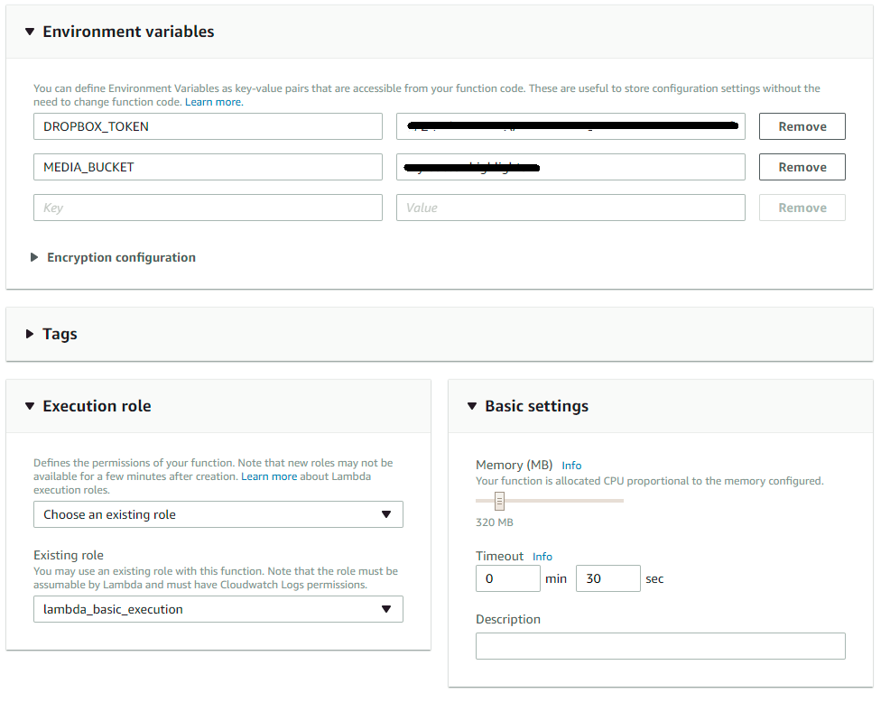
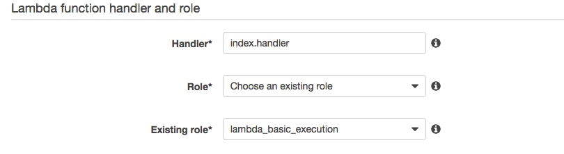
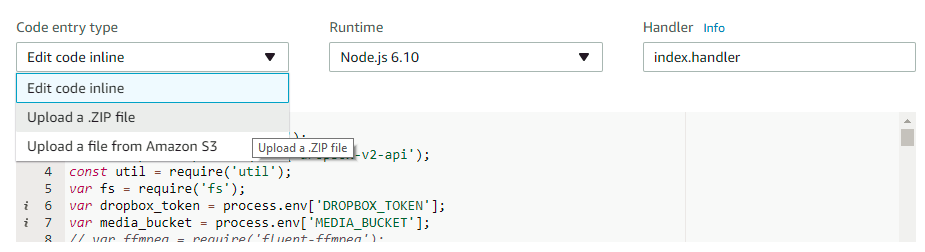
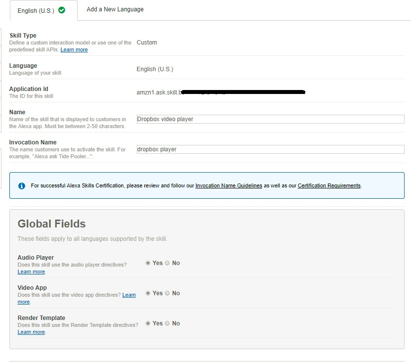
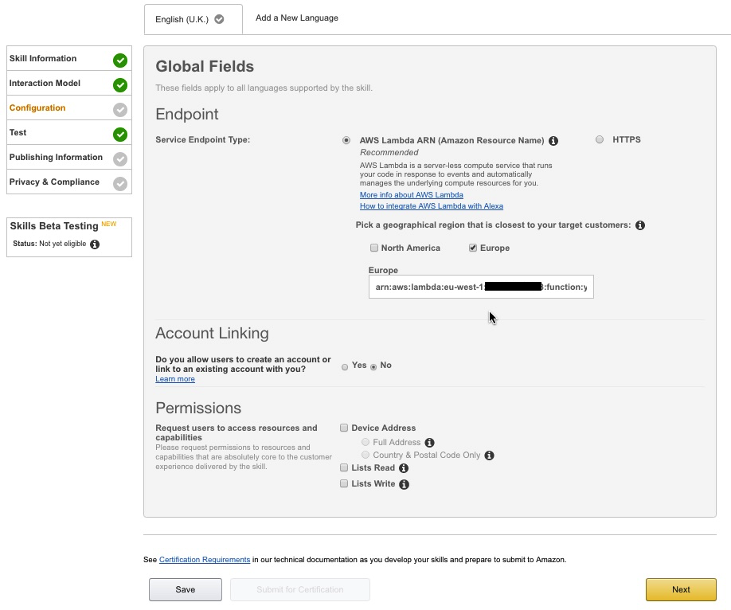

# video-streaming-alexa-skill
Skill for streaming Dropbox videos in alexa devices with screen (e.g: Echo Show)

## SETUP INSTRUCTIONS

## Get a Dropbox Token

1. Create a dropbox access token using the instructions here:-
https://blogs.dropbox.com/developers/2014/05/generate-an-access-token-for-your-own-account/

2. Create a Alexa/ folder inside your Dropbox account and add any video files you want to stream

## Download code from github

1. Click on the green "Clone or download" button just under the yellow bar
2. Click download ZIP
3. Unzip the file 

## AWS Lambda Setup

1. Go to http://aws.amazon.com/. You will need to set-up an AWS account (the basic one will do fine) if you don't have one already. Make sure you use the same Amazon account that your Echo device is registered to. **Note - you will need a credit or debit card to set up an AWS account - there is no way around this. Please see the AWS Charges section above**

2.  Go to the drop down "Location" menu at the top right and ensure you select US-East (N. Virginia) if you are based in the US or EU(Ireland) if you are based in the UK or Germany. This is important as only these two regions support Alexa. NOTE: the choice of either US or EU is important as it will affect the results that you get. The EU node will provide answers in metric and will be much more UK focused, whilst the US node will be imperial and more US focused.


1. Select Lambda from the AWS Services menu at the top left
2. Click on the "Create a Lambda Function" or "Get Started Now" button.
3. Select "Blank Function" - this will automatically take you to the "Configure triggers" page.
4. Click the dotted box and select "Alexa Skills Kit" (NOTE - if you do not see Alexa Skill Kit as an option then you are in the wrong AWS region). 
5. Click Next 
5. Name the Lambda Function, e.g:-

    ```
    dropboxPlayerSkill
    ```
    
5. Set a decription, e.g:-

    ```
    Alexa Dropbox video player skill
    ```
    
6. Select the default runtime which is currently "node.js 6.10".
7. Select Code entry type as "Upload a .ZIP file". 


7. Click on the "Upload" button. Go to the folder where you unzipped the files you downloaded from Github, select index.zip and click open. 
8. Enter the following into the Environment Variables Section (If you are pasting in the Token then make sure you have no extra spaces: -

|Key           | Value|
|--------------| -----|
|DROPBOX_TOKEN|(Put the Dropbox token in here)|
|MEDIA_BUCKET|(Put your public S3 bucket name with images/logos here)|

 

9. Keep the Handler as "index.handler" (this refers to the main js file in the zip).
10. Under Role - select "Create a custom role". This will automatically open a new browser tab or window.


11. Switch to this new tab or window. 
11. Under IAM Role select "Create a new IAM Role"
11. Then press the blue "Allow" box at the bottom right hand corner. The tab/window will automatically close.
11. You should now be back on the Lambda Management page. The Role box will have automatically changed to "Choose an existing role" and Role we just created will be selected under the "Existing role" box.



12. Under Advanced Settings set Memory (MB) to 320 and change the Timeout to 0 minutes 30 seconds


13. Once saved, click on the tab below code entry type and choose upload a .ZIP file. We will upload the video-streaming-alexa-skill.zip file to Lambda.

 

14. Copy the ARN from the top right to be used later in the Alexa Skill Setup (it's the text after ARN - it won't be in bold and will look a bit like this arn:aws:lambda:eu-west-1:XXXXXXX:function:youtube). Hint - Paste it into notepad or similar.

## Alexa Skill Setup

1. In a new browser tab/window go to the Alexa Console (https://developer.amazon.com/edw/home.html and select Alexa on the top menu). If you have not registered as an Amazon Developer then you will need to do so. Once you are logged into your account go to to the Alexa tab at the top of the page.
  
2. Click on the yellow "Get Started" button under Alexa Skills Kit.


3. Click the "Add a New Skill" box towards the top right.


4. You will now be on the "Skill Information" page.
5. Set "Custom Interaction Model" as the Skill type
6. Select the language as English (US) or English (UK)
6. Set the "Name" to 

    ```
    Dropbox video player
    ```
    
8. Set the "Invocation Name" to 

    ```
    Dropbox player
    ```
8. Set the "Audio Player" setting to "Yes"
8. Leave the other settings in Global Fields set to "No'
9. Click "Save" and then click "Next".



10. You will now be on the "Invocation Model" page.
11. Copy the text below into the "Intent Schema" box - Ignore the "Built-in intents for playback control box above"

    ```
    {
      "intents": [
        {
          "intent": "AMAZON.StopIntent"
        },
        {
          "intent": "AMAZON.NavigateSettingsIntent"
        },
        {
          "intent": "AMAZON.MoreIntent"
        },
        {
          "intent": "AMAZON.PageDownIntent"
        },
        {
          "intent": "AMAZON.PageUpIntent"
        },
        {
          "intent": "AMAZON.ScrollRightIntent"
        },
        {
          "intent": "AMAZON.ScrollDownIntent"
        },
        {
          "intent": "AMAZON.ScrollLeftIntent"
        },
        {
          "intent": "AMAZON.ScrollUpIntent"
        },
        {
          "intent": "AMAZON.HelpIntent"
        },
        {
          "intent": "AMAZON.NextIntent"
        },
        {
          "intent": "AMAZON.PreviousIntent"
        },
        {
          "intent": "AMAZON.PauseIntent"
        },
        {
          "intent": "AMAZON.ResumeIntent"
        },
        {
          "slots": [
            {
              "name": "number",
              "type": "AMAZON.NUMBER"
            }
          ],
          "intent": "NumberIntent"
        },
        {
          "intent": "DemoIntent"
        },
        {
          "slots": [
            {
              "name": "search",
              "type": "SEARCH"
            },
            {
              "name": "secondSearch",
              "type": "AMAZON.SportsTeam"
            }
          ],
          "intent": "SearchIntent"
        },
        {
          "slots": [
            {
              "name": "search",
              "type": "SEARCH"
            }
          ],
          "intent": "ShowIntent"
        },
        {
          "intent": "EditAccountIntent"
        }
      ]
    }
    ```


12. Under Custom Slot Types:-
13. Type into the "Enter Type" field (NOTE - this is captialised) :-
    ```
    SEARCH
    ```
    
14. Copy the text below and paste into the "Enter Values" box and then click "Add" (NOTE you must click ADD)

    ```
    match
    prince
    video
    the fray
    the rolling stones
    ultra nate
    NYC
    Seattle
    Chelsea
    Portland
    ```

15. Copy the text below and paste them into the Sample Utterances box.

    ```
    NumberIntent {number}
    NumberIntent play number {number}
    NumberIntent play track {number}
    NumberIntent play track number {number}
    DemoIntent demo
    SearchIntent play highlights from {search} match
    SearchIntent play highlights from the {search} and {secondSearch} match
    SearchIntent play {search}
    SearchIntent find {search}
    SearchIntent play some {search}
    SearchIntent play me some {search}
    SearchIntent videos by {search}
    SearchIntent for videos by {search}
    SearchIntent for audio by {search}
    ShowIntent show me videos from {search}
    ShowIntent show me the latest highlights from {search}
    ShowIntent show me the latest videos from {search}
    ```
 

16. Click "Save" and then "Next".
17. You will now be on the "Configuration" page.
18. Select "AWS Lambda ARN (Amazon Resource Name)" for the skill Endpoint Type.
19. Then pick the most appropriate geographical region (either US or EU as appropriate) and paste into the box (highlighted in red in the screenshot) the ARN you copied earlier from the AWS Lambda setup.
20. Select "No" for Account Linking and leave everything under permissions unchecked
21. Click "Save" and then "Next".
 
22. There is no need to go any further through the process i.e. submitting for certification.
23. You can start testing writing something like `Alexa, launch dropbox player` which will return a list of media players in the Dropbox Alexa/ folder and ask you what do you want to play.
Right now the test service simulator do not simulate video or long audio so for fully testing the app and receiving video you will need an echo show.  

 
 ### Credit where credit is due:
 
 - Readme and code pieces from: https://github.com/Fenton-Fenton-Fenton/alexa-tube
 - Amazon Alexa Skill Kit: https://developer.amazon.com/alexa-skills-kit 